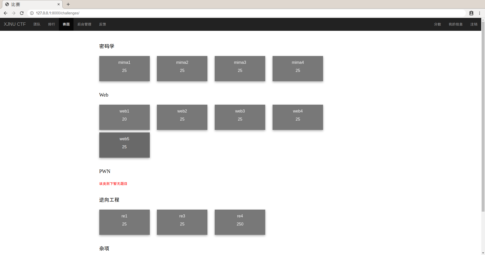
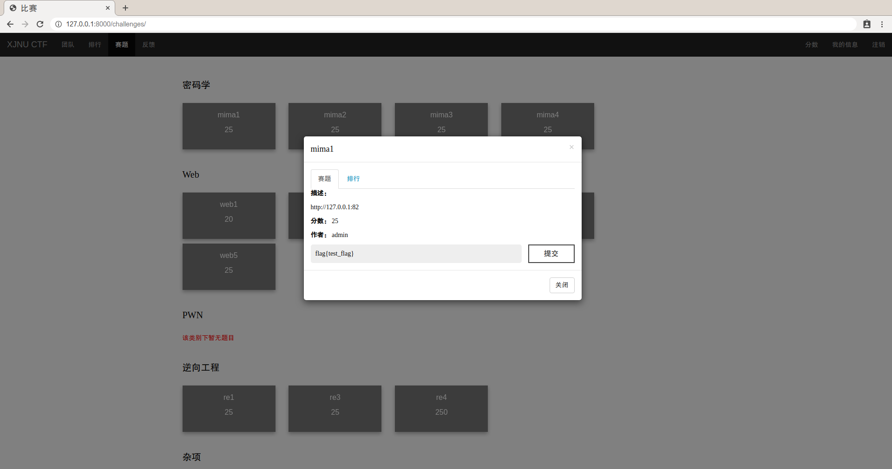
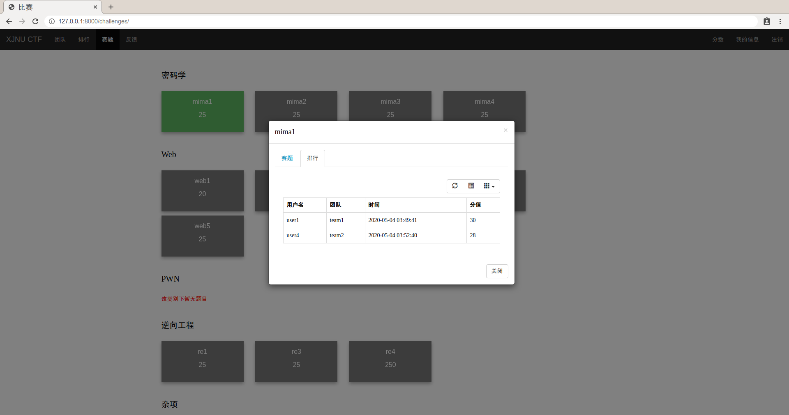
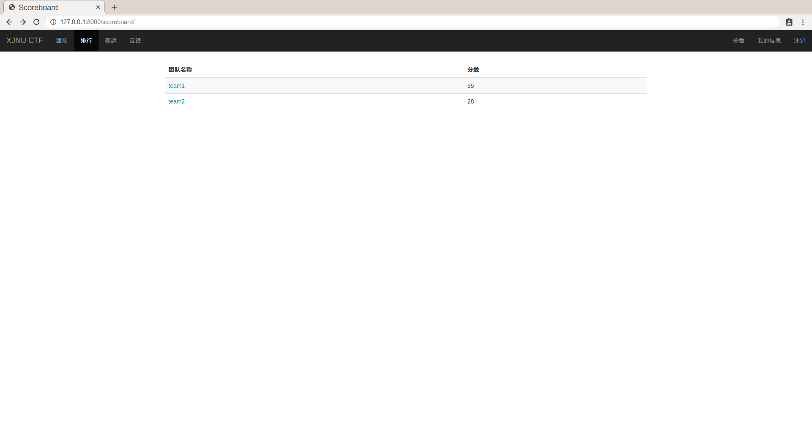
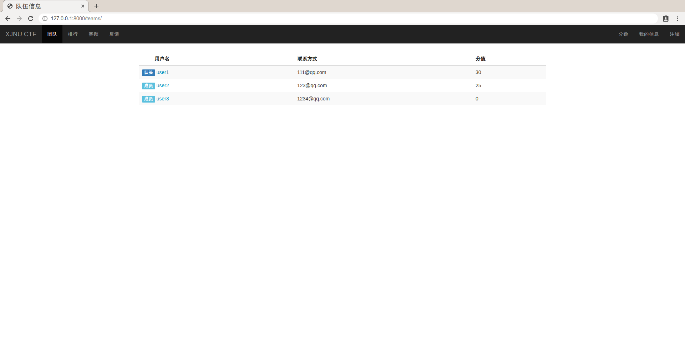
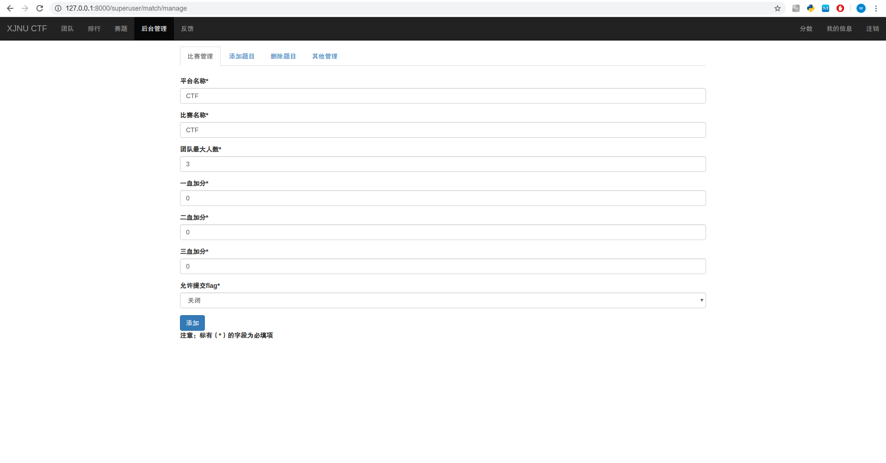
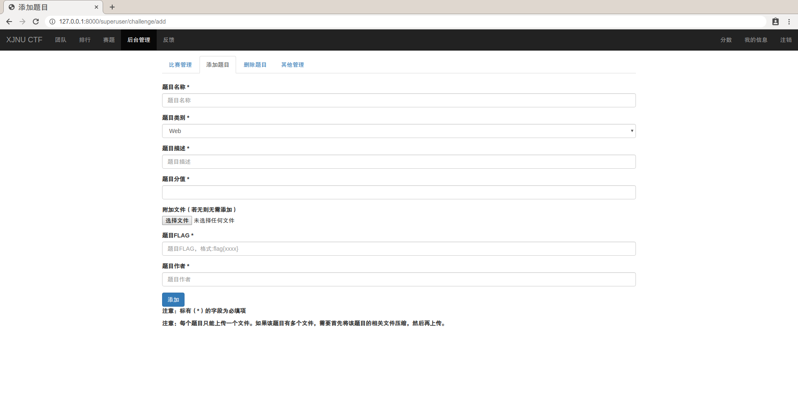

本项目是一个轻量级的CTF竞赛平台，常用功能完善。

#### 运行截图 :
赛题


提交flag


查看每道题排名


总体排名


团队内部排名


后台管理


添加题目



#### 使用
###### 依赖
```
Python 3.6.9
Django 2.0
```

###### 安装Django2.0

```sh
$ sudo pip3 install django==2.0
```
###### 使用该平台

```sh
$ python3 manage.py makemigrations accounts challenges
$ python3 manage.py migrate #迁移
$ python3 manage.py createsuperuser #创建管理员
$ python3 manage.py runserver #运行服务
```
使用管理员账号登录可以访问Djano管理后台或者平台后台管理平台以及添加题目等等操作，参赛选手需要注册。
